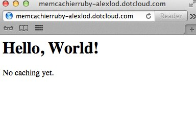
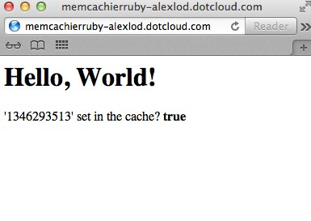

MemCachier
==========

This tutorial will walk you through using MemCachier's managed memcache solution to help you scale your app with memcache.

Memcache is one of the most commonly used tools for helping a website scale.  Memcache is an in-memory, distributed cache. The primary API for interacting with it are `SET(key, value)` and `GET(key)` operations.  Memcache is essentially a hashmap (or dictionary) that is spread across multiple servers, where operations are still performed in constant time.

The most common usage of memcache is to cache expensive database queries and HTML renders such that these expensive operations don’t need to happen over and over again.

`MemCachier <http://memcachier.com>`_ manages and scales clusters of memcache servers so you can focus on your app.

The source code for this example is `available on Github <https://github.com/memcachier/memcachier-dotcloud-ruby/>`_.

This tutorial shows a Ruby example, but memcache is by no way specific to Ruby: you can also use it with PHP, Java, Python, Perl, Node.js...

dotCloud "Hello, World"
-----------------------

We'll start by creating a simple "Hello, World" app in Ruby using Sinatra.

We need to declare a single ruby service in `dotcloud.yml`.  The role and syntax of the `dotCloud Build File <http://docs.dotcloud.com/0.4/guides/build-file/>`_ is explained in further detail in the documentation. Here is our `dotcloud.yml`::

    www:
      type: ruby

Next add a basic `app.rb` using `sinatra`, a lightweight Ruby web framework::

    require 'sinatra'

    get '/' do
      erb :index
    end

And a corresponding `views/index.erb` view file::

    <h1>Hello, World!</h1>

    
No caching yet.

Other files are required to successfully deploy this app, such as `config.ru`, `Gemfile`, and an empty `public/` folder.  Refer to the `git repo <https://github.com/memcachier/memcachier-dotcloud-ruby>`_ for the source of these files.  Don't forget to run `bundle install` once you've created `Gemfile`.

When you have all files in place (or when you've cloned the git repo), create an app and deploy the code::

    dotcloud create memcachierruby -f sandbox
    dotcloud push memcachierruby

Visiting the URL specified in ``dotcloud url memcachierruby`` will show a basic "Hello, World" app:

Setup MemCachier
----------------

`Create a MemCachier account <https://my.memcachier.com/signup?provider=dotcloud>`_, then create a MemCachier application after you've verified your email address.  After you've created an application, you'll be given a set of credentials that you'll use to connect to MemCachier.  These credentials include:

 * **Servers:** a string representing a list of cache servers.
 * **Username:** a generated username that you'll use to connect to the cache.
 * **Password:** a generated password that you'll use in conjunction with the username.

Add the above credentials to your app's environment via::

    dotcloud var set memcachierruby MEMCACHIER_SERVERS="foo"
    dotcloud var set memcachierruby MEMCACHIER_USERNAME="bar"
    dotcloud var set memcachierruby MEMCACHIER_PASSWORD="baz"

Connect to MemCachier
---------------------

We recommend using the `dalli <https://github.com/mperham/dalli>`_ ruby memcache client to connect to MemCachier.  Add `dalli` to your `Gemfile`:

    gem 'dalli'

And `bundle install`.  The following code will connect to MemCachier.  You'll see how to use this code later::

    require 'json'
    require 'dalli'
    env = JSON.parse(File.read('/home/dotcloud/environment.json'))
    cache = Dalli::Client.new(env["MEMCACHIER_SERVERS"],
                            {:username => env["MEMCACHIER_USERNAME"],
                             :password => env["MEMCACHIER_PASSWORD"]})

Start Caching
-------------

Once `dalli` is connected, you can start using the cache as follows::

    cache.set("foo", "bar")
    cache.get("foo")
     => "bar"

Now we will modify `app.rb` and `index.erb` with a basic memcache example -- we'll set the cache and verify that the value in the cache is correct.  Here's the new `app.rb` file::

    require 'sinatra'
    require 'dalli'
    require 'json'
    
    get '/' do
      # parse environment variables.
      env = JSON.parse(File.read('/home/dotcloud/environment.json'))
      
      # connect to MemCachier.
      cache = Dalli::Client.new(env["MEMCACHIER_SERVERS"],
                                {:username => env["MEMCACHIER_USERNAME"],
                                 :password => env["MEMCACHIER_PASSWORD"]})

      # attempt to set and get a value.  Verify the value was set
      # correctly.
      val = Time.now.to_i
      cache.set("key", val)
      cached_val = cache.get("key")
      cache_is_working = val == cached_val
    
      erb :index, :locals => {
        :val => val,
        :cache_is_working => cache_is_working
      }
    end

And here's the new `index.erb` file::

    <h1>Hello, World!</h1>
    
    
'<%= val %>' set in the cache? <strong><%= cache_is_working %></strong>

Visiting your app again should show something like this:

Learning More
-------------

Refer to `MemCachier's documentation <https://my.memcachier.com/documentation/ec2>`_ to see how you can use MemCachier in other languages.  To learn more about memcache, read the `memcache user guide <http://www.memcachier.com/documentation/memcache-user-guide/>`_.
